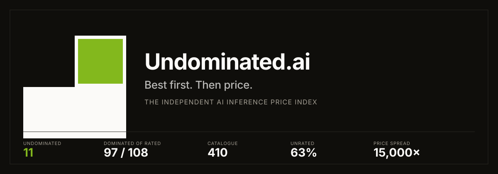
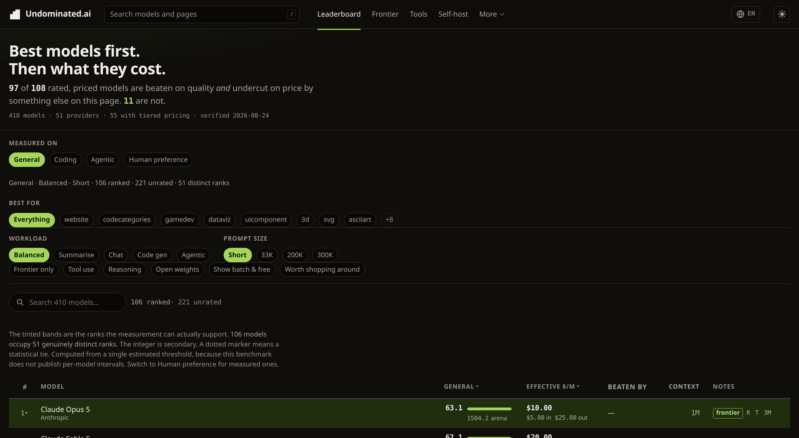
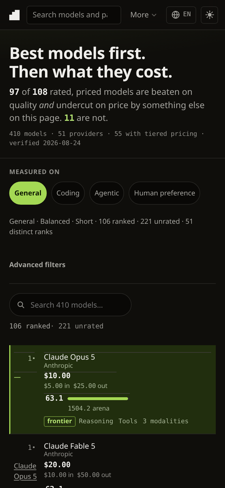
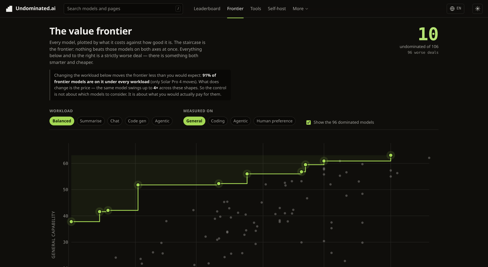
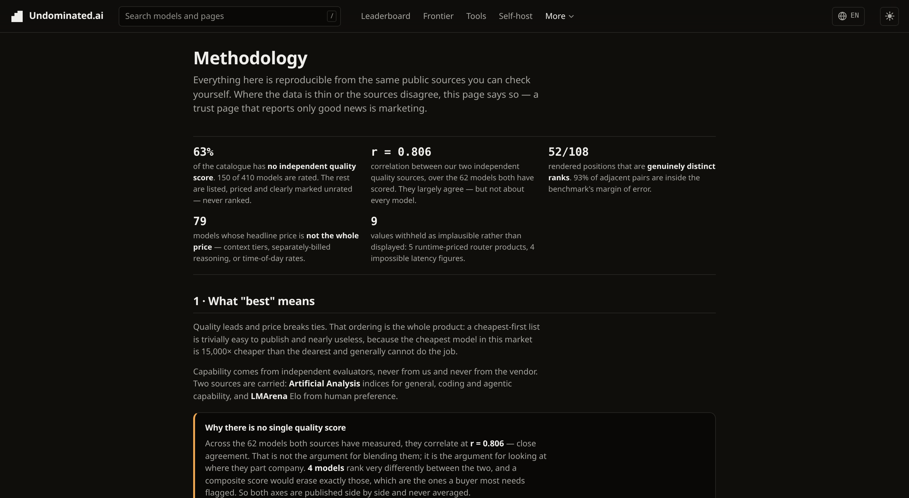
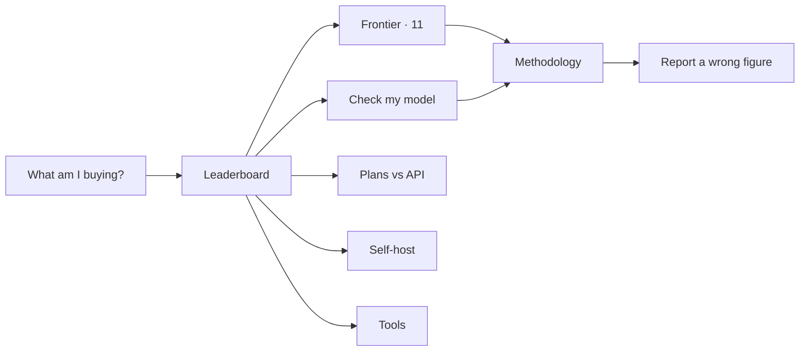

  <a href="https://undominated.ai/">
    <picture>
      <source media="(prefers-color-scheme: dark)" srcset="docs/brand/lockup-dark.svg">
      
    </picture>
  </a>

  <strong>Best first. Then price.</strong> 
  <em>The independent AI inference price index.</em>

  
  
  
  

  

---

Most AI “value” tables invent a score, then sort by it.

Undominated.ai does the opposite. It ranks on **independently measured capability first**. Price breaks ties. A model that is both worse and dearer is named as such. A model that has not been measured is **unrated**, never zero.

> **97 of 108** rated, priced models are beaten on quality *and* undercut on price by something else on the board. 
> **11** are not. That set is the value frontier.

The numbers above are a snapshot from 24 August 2026. They move. The live board is the source, not this README.

  <a href="https://undominated.ai/"><strong>Open the index →</strong></a>
  &nbsp;·&nbsp;
  <a href="https://undominated.ai/frontier/">The 11 that survive</a>
  &nbsp;·&nbsp;
  <a href="https://undominated.ai/check/">Check the model you already pay for</a>

  
   
  Live board · quality first · chartreuse is frontier membership, not decoration

<table>
  <tr>
    <td width="42%" valign="top">
      
    </td>
    <td width="58%" valign="top">
      
    </td>
  </tr>
</table>

---

## Why a price index that refuses to average

The spread between the cheapest and the dearest model in the catalogue is about **15,000×**. That is not a rounding error. It is the reason a “value score” is a marketing instrument: it can hide a worse-and-dearer row behind a single attractive number.

Undominated.ai publishes the uncomfortable version:

| Claim the market likes | What this index actually does |
| --- | --- |
| A blended “value” rank | Capability first, effective price second. Never mixed into one score. |
| Unrated at the bottom | Unrated is not zero. **63%** of the catalogue has no independent quality score. Those rows are listed by price and excluded from quality order. |
| Integer ranks as fact | Significance ranks. Models the benchmark cannot separate **share a rank**. 108 rated positions collapse to **52** genuinely distinct ranks. |
| “Cheaper is better” | Cheaper is cheaper. A strict upgrade is a capability *superset* that also costs less: same context, same modalities, same tools. |
| Headline $/M | **55** models change rate past a context threshold. The board reprices the row when your prompt crosses it. |
| Affiliate “best” lists | **No cut of inference. No affiliate. No paid placement. No gateway.** |

The method, the hedges, and the licensing limits: [undominated.ai/methodology](https://undominated.ai/methodology/).

  

---

## The instrument

Every route answers a decision, not a document type.

| You want to | Open |
| --- | --- |
| See what is actually worth buying | [Leaderboard](https://undominated.ai/) |
| See the 11 nothing beats on both axes | [Frontier](https://undominated.ai/frontier/) |
| Test the model you already use | [Check](https://undominated.ai/check/) |
| Compare subscription plans to API | [Plans](https://undominated.ai/plans/) |
| Find the cheapest model above a quality floor | [Cheapest at](https://undominated.ai/cheapest-at/) |
| Ask whether you can self-host | [Self-host](https://undominated.ai/self-host/) |
| Scan agentic coding tools | [Tools](https://undominated.ai/tools/) |
| Read how ranking is computed | [Methodology](https://undominated.ai/methodology/) |
| Hold the commercial boundaries | [Independence](https://undominated.ai/independence/) |
| See applied corrections | [Corrections](https://undominated.ai/corrections/) |

English is the source language. Nineteen locales ship as machine translation with numbers, model names, and provider names left untouched. Model pages stay English-only.

---

## What “undominated” means here

A model is **dominated** when another model in the catalogue scores higher *and* costs less *and* can do everything it can do.

A model is **on the frontier** when nothing in the catalogue is both better and cheaper under the selected lens and workload.

That is a Pareto statement, not a vibe. Chartreuse in the interface is reserved for frontier membership. It is not a brand highlight colour.

Two capability sources are published **side by side and never blended**: independent index scores, and LMArena human preference. Switching the lens re-ranks the board. It does not invent a hybrid number.

---

## This repository

**Undominated.ai lives at [undominated.ai](https://undominated.ai/).** This GitHub repository is the public face of that product: a landing page you can star, cite, and link, and a **public issue tracker** for corrections.

It is not a dump of the catalogue. It is not a place to send scraped prices. It is not a second copy of the ranking engine.

| In this repo | On the live site |
| --- | --- |
| This README | The ranked board, updated from sourced pages |
| Issue templates | Prices, scores, significance ranks |
| Brand mark and screenshots | 19 locales, Markdown, JSON, RSS |
| Security contact | Methodology, independence, corrections log |

Machine-readable surfaces stay on the origin, where they can carry provenance:

- [`/llms.txt`](https://undominated.ai/llms.txt) — facts for agents
- [`/data/catalogue.json`](https://undominated.ai/data/catalogue.json) — the public catalogue
- [`/?format=md`](https://undominated.ai/?format=md) — any page as Markdown

---

## Report a wrong figure

If a live price, score, or rank disagrees with a primary source, file it here. The form requires the model, what the page shows, what it should be, a source URL, and the date you checked.

  <a href="https://github.com/Lenvanderhof/Undominated.ai/issues/new?template=wrong-price.yml"><strong>Open a correction issue →</strong></a> 
  Same form as <a href="https://undominated.ai/report/">undominated.ai/report</a>. Corrections with a primary source are applied on the site.

Security reports: [open an advisory on this repository](https://github.com/Lenvanderhof/Undominated.ai/security/advisories/new). Do not use a public issue for anything that would let someone alter rankings.

---

## Independence, in one screen

- No cut of inference.
- No affiliate links.
- No paid placement, badges, or “featured” rows.
- No gateway. We do not sit on the request path.
- Revenue in v1: none. A later paid feed, if it exists, would sell history and provenance — not a better rank.

The charter: [undominated.ai/independence](https://undominated.ai/independence/).

---

## Licensing, said plainly

LMArena leaderboard data on the site is used under **CC BY 4.0** from the official dataset.

Artificial Analysis figures on the site are **shown for evaluation**. Redistribution terms remain unresolved. **This repository does not grant a sublicence** to republish those scores, and it does not copy them into Git.

Vendor prices are facts the vendor published. Every live row is supposed to carry a source link and a fetch date. If one does not, that is a [correction](https://github.com/Lenvanderhof/Undominated.ai/issues/new?template=wrong-price.yml).

---

  <a href="https://undominated.ai/">
    <picture>
      <source media="(prefers-color-scheme: dark)" srcset="docs/brand/mark-dark.svg">
      
    </picture>
  </a>
   
  <strong><a href="https://undominated.ai/">undominated.ai</a></strong>
   
  Best first. Then price. · Len van der Hof · 2026

