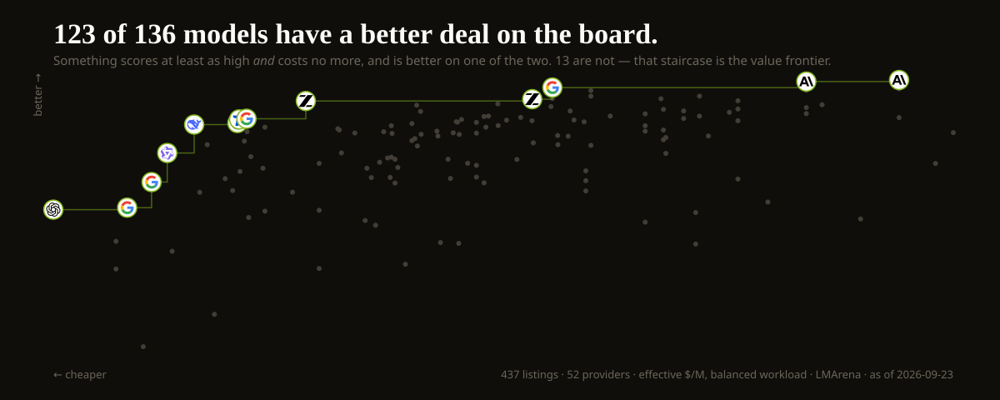
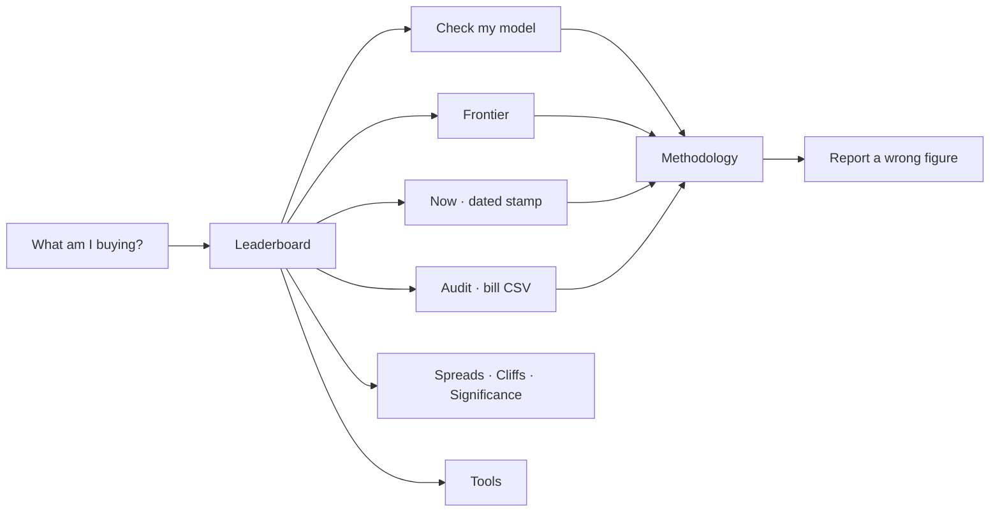
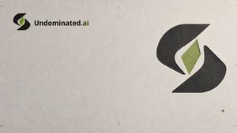

<p align="center">
  <a href="https://undominated.ai/">
    <picture>
      <source media="(prefers-color-scheme: dark)" srcset="docs/brand/lockup-dark.png">
      
    </picture>
  </a>
</p>

<p align="center">
  <strong>Best first. Then price.</strong><br>
  <em>The independent AI inference price index.</em>
</p>

<p align="center">
  <a href="https://undominated.ai/"></a>
  <a href="https://undominated.ai/frontier/"></a>
  <a href="https://undominated.ai/check/"></a>
  <a href="https://www.npmjs.com/package/undominated-check"></a>
  <a href="https://huggingface.co/datasets/LPH98/undominated-ai-model-pricing"></a>
  <a href="https://github.com/Lenvanderhof/Undominated.ai/issues/new?template=wrong-price.yml"></a>
</p>

<p align="center">
  <a href="https://undominated.ai/models/anthropic__claude-opus-5/">
    
  </a>
</p>

---

## Copy a badge

The SVG is the published verdict. Swap the slug for the model you ship.

```markdown
[](https://undominated.ai/models/anthropic__claude-opus-5/)
```

`<key>` is the same segment as `/models/<key>/`. Replace `/` and `:` in the model id with `__`. The badge states one model's dominance verdict at the balanced workload on the LMArena lens, with the date it was computed. It changes when that verdict changes. Unrated is labelled unrated, not scored zero.

## Check a model

```sh
npx --yes undominated-check google/gemini-3.7-flash
```

Read-only. It fetches published JSON from [undominated.ai](https://undominated.ai), prints the verdict, and exits. It sends nothing, stores nothing, and needs no key. Package: [`undominated-check@0.1.0`](https://www.npmjs.com/package/undominated-check) (MIT, 2026-09-01). GitHub remains an installable source: `npx --yes github:Lenvanderhof/Undominated.ai google/gemini-3.7-flash`.

## Warn on a dominated model (GitHub Action)

```yaml
# .github/workflows/undominated-warn.yml
name: undominated-warn
on:
  pull_request:
jobs:
  warn:
    runs-on: ubuntu-latest
    permissions:
      contents: read
      pull-requests: write
    steps:
      - uses: actions/checkout@v4
      - uses: Lenvanderhof/Undominated.ai/actions/dominated-warn@main
        continue-on-error: true
```

Warns. Never fails the job. Do not add it to required checks.

---

<p align="center">
  <a href="https://undominated.ai/frontier/">
    
  </a>
</p>

<p align="center">
  <sub>Every dot is a published price. Generated from the live board by <code>scripts/build-hero.mjs</code> — no figure on this page is typed by hand.</sub>
</p>

---

Most AI “value” tables invent a score, then sort by it.

Undominated.ai does the opposite. It ranks on **independently measured capability first**. Price breaks ties. A model that is both worse and dearer is named as such. A model that has not been measured is **unrated**, never zero.

> **<!--fig:dominatedOfRated-->122 of 132<!--/fig-->** rated, priced models are beaten on quality *and* undercut on price by something else on the board.<br>
> **<!--fig:frontier-->10<!--/fig-->** are not. That set is the value frontier.

Every figure on this page is generated from the live catalogue by `scripts/refresh-readme.mjs`, last on **<!--fig:asOf-->2026-09-04<!--/fig-->** (<!--fig:models-->414<!--/fig--> models, <!--fig:providers-->49<!--/fig--> providers). It is checked in CI, because a README that states a number by hand states a wrong one within the week. **[The live board is still the source](https://undominated.ai/).**

<p align="center">
  <a href="https://undominated.ai/"><strong>Open the index →</strong></a>
  &nbsp;·&nbsp;
  <a href="https://undominated.ai/check/">Check the model you already pay for</a>
  &nbsp;·&nbsp;
  <a href="https://undominated.ai/now/">Dated stamp</a>
</p>

<p align="center">
  <a href="https://undominated.ai/">
    
  </a>
  <br>
  <sub>Live board · Dual Witness lockup · chartreuse is frontier membership, not decoration</sub>
</p>

<table>
  <tr>
    <td width="38%" valign="top">
      <a href="https://undominated.ai/"></a>
      <br>
      <sub>Phone · first cards, including who beats the row</sub>
    </td>
    <td width="62%" valign="top">
      <a href="https://undominated.ai/frontier/"></a>
      <br>
      <sub>Frontier · staircase is the argument</sub>
    </td>
  </tr>
  <tr>
    <td valign="top">
      <a href="https://undominated.ai/check/"></a>
      <br>
      <sub><a href="https://undominated.ai/check/">Check</a> · paste what you already pay for</sub>
    </td>
    <td valign="top">
      <a href="https://undominated.ai/tools/"></a>
      <br>
      <sub><a href="https://undominated.ai/tools/">Tools</a> · coverage, not a quality score</sub>
    </td>
  </tr>
</table>

<p align="center">
  <a href="https://undominated.ai/now/">
    
  </a>
  <br>
  <sub><a href="https://undominated.ai/now/">Now</a> · a stamp with a date and a hash, not a blended index</sub>
</p>

---

## Why a price index that refuses to average

The spread between the cheapest and the dearest input price in the catalogue is about **<!--fig:spread-->8,824×<!--/fig-->**. That is not a rounding error. It is the reason a “value score” is a marketing instrument: it can hide a worse-and-dearer row behind a single attractive number.

Undominated.ai publishes the uncomfortable version:

| Claim the market likes | What this index actually does |
| --- | --- |
| A blended “value” rank | Capability first, effective price second. Never mixed into one score. |
| Unrated at the bottom | Unrated is not zero. **<!--fig:unratedPct-->68%<!--/fig-->** of the catalogue (<!--fig:unrated-->282<!--/fig--> of <!--fig:models-->414<!--/fig-->) has no independent quality score. Those rows are listed by price and excluded from quality order. |
| Integer ranks as fact | Significance ranks. Models the benchmark cannot separate **share a rank** — roughly half the ranked board collapses into shared positions once the published confidence intervals are drawn. [The live board states the exact split](https://undominated.ai/); it moves whenever a score does, so it is not repeated here. |
| “Cheaper is better” | Cheaper is cheaper. A strict upgrade is a capability *superset* that also costs less: same context, same modalities, same tools. |
| Headline $/M | **<!--fig:tiered-->56<!--/fig-->** models change rate past a context threshold. The board reprices the row when your prompt crosses it. |
| Affiliate “best” lists | **No cut of inference. No affiliate. No paid placement. No gateway.** |

The method, the hedges, and the licensing limits: [undominated.ai/methodology](https://undominated.ai/methodology/).

<p align="center">
  <a href="https://undominated.ai/methodology/">
    
  </a>
</p>

---

## The instrument

Every route answers a decision, not a document type.

| You want to | Open |
| --- | --- |
| See what is actually worth buying | [Leaderboard](https://undominated.ai/) |
| See the 11 nothing beats on both axes | [Frontier](https://undominated.ai/frontier/) |
| Test the model you already use | [Check](https://undominated.ai/check/) |
| Cite a dated stamp | [Now](https://undominated.ai/now/) |
| Cite the licence-gated dump | [Hugging Face dataset](https://huggingface.co/datasets/LPH98/undominated-ai-model-pricing) · [GitHub Release](https://github.com/Lenvanderhof/Undominated.ai/releases/tag/catalogue-2026-08-31) · [`CITATION.cff`](CITATION.cff) |
| Compare subscription plans to API | [Plans](https://undominated.ai/plans/) |
| Find the cheapest model above a quality floor | [Cheapest at](https://undominated.ai/cheapest-at/) |
| See whether shopping around is worth it | [Providers](https://undominated.ai/providers/) · [Spreads](https://undominated.ai/spreads/) |
| See context-tier step functions | [Cliffs](https://undominated.ai/cliffs/) |
| See which adjacent ranks the benchmark cannot separate | [Significance](https://undominated.ai/significance/) |
| Browse every publishable model | [All models](https://undominated.ai/models/) |
| Ask whether you can self-host | [Self-host](https://undominated.ai/self-host/) |
| Scan agentic coding tools | [Tools](https://undominated.ai/tools/) |
| Run a usage export through dominance (client-side; no upload) | [Audit](https://undominated.ai/audit/) |
| Read how ranking is computed | [Methodology](https://undominated.ai/methodology/) |
| Hold the commercial boundaries | [Independence](https://undominated.ai/independence/) |
| See applied corrections | [Corrections](https://undominated.ai/corrections/) |
| File a wrong figure | [Report](https://undominated.ai/report/) |



English is the source language. Nineteen locales ship as machine translation with numbers, model names, and provider names left untouched. Model pages stay English-only.

---

## What “undominated” means here

A model is **dominated** when another model in the catalogue scores higher *and* costs less *and* can do everything it can do.

A model is **on the frontier** when nothing in the catalogue is both better and cheaper under the selected lens and workload.

That is a Pareto statement, not a vibe. Chartreuse in the interface is reserved for frontier membership. It is not a brand highlight colour.

Two capability sources are published **side by side and never blended**: independent index scores, and LMArena human preference. Switching the lens re-ranks the board. It does not invent a hybrid number.

---

## This repository

**Undominated.ai lives at [undominated.ai](https://undominated.ai/).** This GitHub repository is the public face of that product: a landing page you can star, cite, and link, and a **public issue tracker** for corrections.

It is not a dump of the catalogue. It is not a place to send scraped prices. It is not a second copy of the ranking engine.

| In this repo | On the live site |
| --- | --- |
| This README | The ranked board, updated from sourced pages |
| Issue templates | Prices, scores, significance ranks |
| Brand mark and screenshots | 19 locales, Markdown, JSON, RSS |
| Security contact | Methodology, independence, corrections log |

Machine-readable surfaces stay on the origin, where they can carry provenance:

- [`/llms.txt`](https://undominated.ai/llms.txt) — facts for agents
- [`/data/catalogue.json`](https://undominated.ai/data/catalogue.json) — the public catalogue
- [`/badge/<key>.svg`](https://undominated.ai/badge/anthropic__claude-opus-5.svg) — README dominance badge
- [`/?format=md`](https://undominated.ai/?format=md) — any page as Markdown
- [`/now/`](https://undominated.ai/now/) — dated frontier stamp (hash on the page)

---

## Report a wrong figure

If a live price, score, or rank disagrees with a primary source, file it here. The form requires the model, what the page shows, what it should be, a source URL, and the date you checked.

<p align="center">
  <a href="https://github.com/Lenvanderhof/Undominated.ai/issues/new?template=wrong-price.yml"><strong>Open a correction issue →</strong></a><br>
  <sub>Same form as <a href="https://undominated.ai/report/">undominated.ai/report</a>. Corrections with a primary source are applied on the site. Public log: <a href="https://undominated.ai/corrections/">/corrections/</a>.</sub>
</p>

Security reports: [open an advisory on this repository](https://github.com/Lenvanderhof/Undominated.ai/security/advisories/new). Do not use a public issue for anything that would let someone alter rankings.

---

## Independence, in one screen

- No cut of inference.
- No affiliate links.
- No paid placement, badges, or “featured” rows.
- No gateway. We do not sit on the request path.
- Revenue in v1: none. A later paid feed, if it exists, would sell history and provenance — not a better rank.

The charter: [undominated.ai/independence](https://undominated.ai/independence/).

---

## Is capability actually getting cheaper?

Everyone publishes today's prices. Nobody publishes what the **cheapest model clearing a fixed quality bar** costs, tracked across dated snapshots — and that is the only series that answers the question, because a discount on one SKU is not the same as capability getting cheaper.

<!--floors-->

| Capability floor (LMArena) | 2026-08-24 | 2026-09-04 | Move | Cheapest today |
|:---|---:|---:|---:|:---|
| **≥ 1200** | $0.0525 | $0.0525 | unchanged | `upstage/solar-pro4` |
| **≥ 1350** | $0.0525 | $0.0525 | unchanged | `upstage/solar-pro4` |
| **≥ 1400** | $0.0611 | $0.1097 | +80% | `deepseek/deepseek-v4-flash` |
| **≥ 1450** | $0.4961 | $0.5437 | +10% | `xiaomi/mimo-v2.5-pro` |

<sub>Effective $/M on the balanced workload, from 9 dated snapshots. Generated by `scripts/build-floor-table.mjs`. The floors are append-only — a threshold is never edited in place, because a moved goalpost turns a series into marketing.</sub>

<!--/floors-->

The floors are defined once and never moved. Every point comes from a dated, hashed snapshot that is [published and citable](https://undominated.ai/data/citation.json); the archive only grows, so this series cannot be back-filled by anyone starting tomorrow.

---

## The campaign stills

Three families, shot around the Dual Witness mark. They are scene treatments, **not a second logo**: use them with attribution and never redraw the mark from a photograph.

<table>
  <tr>
    <td width="33%" align="center">
      <br>
      <sub><strong>Material Witness</strong><br>the primary family</sub>
    </td>
    <td width="33%" align="center">
      <br>
      <sub><strong>Proof Cinema</strong><br>supporting</sub>
    </td>
    <td width="33%" align="center">
      <br>
      <sub><strong>Evidence Editorial</strong><br>supporting</sub>
    </td>
  </tr>
</table>

All fifteen, at full resolution with the mark, the lockups and the usage rules: **[undominated.ai/press/](https://undominated.ai/press/)**.

---

## Licensing, said plainly

LMArena leaderboard data on the site is used under **CC BY 4.0** from the official dataset.

Artificial Analysis figures are **not published** on the site at all. There is no redistribution licence, so they inform what gets checked and never what a reader sees — `scripts/audit-aa-exposure.mjs` puts a model's own page publishing its own AA value at **0 of 179**. **This repository does not grant a sublicence** to republish those scores, and it does not copy them into Git.

Vendor prices are facts the vendor published. Every live row is supposed to carry a source link and a fetch date. If one does not, that is a [correction](https://github.com/Lenvanderhof/Undominated.ai/issues/new?template=wrong-price.yml).

---

<p align="center">
  <a href="https://undominated.ai/">
    <picture>
      <source media="(prefers-color-scheme: dark)" srcset="docs/brand/raster/mark-dark-on-dark-128.png">
      
    </picture>
  </a>
  <br>
  <strong><a href="https://undominated.ai/">undominated.ai</a></strong>
  <br>
  <sub>Best first. Then price. · Len van der Hof · 2026</sub>
</p>
