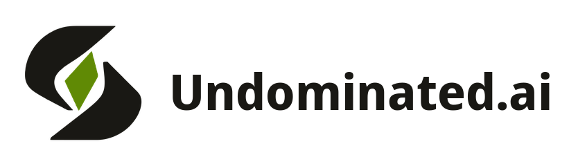
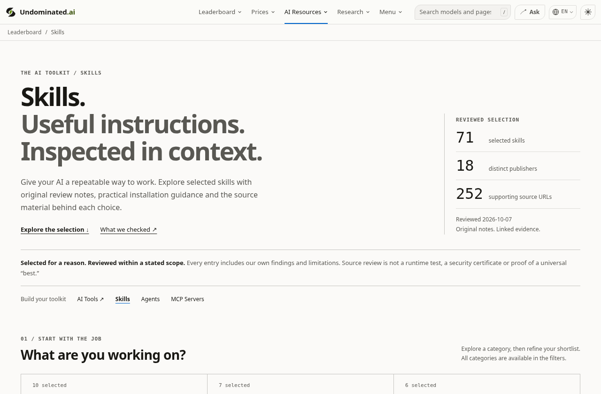

<p align="center">
  <a href="https://undominated.ai/">
    <picture>
      <source media="(prefers-color-scheme: dark)" srcset="docs/brand/lockup-dark.png">
      
    </picture>
  </a>
</p>
<p align="center"><strong>Best first. Then price.</strong><br>Compare models. Inspect the evidence. Bring the checks into your own workflow.</p>
<p align="center">
  <a href="https://undominated.ai/">Open the platform</a> ·
  <a href="docs/GETTING-STARTED.md">Get started</a> ·
  <a href="docs/RESOURCES.md">Browse the source library</a> ·
  <a href="https://github.com/Lenvanderhof/Undominated.ai/discussions">Ask a question</a>
</p>

**Undominated.ai compares AI models by independently measured capability and published price.** The website brings together model comparisons, provider offers, cost tools and reviewed AI resources. This repository supplies the installable skills, portable agent profiles, CLI and read-only MCP server, plus a public place to report corrections.

[](https://undominated.ai/skills/)

<sub>Live skills directory captured on 2026-10-07. Browse the current page for the latest reviews.</sub>

## Start with the job

| You want to… | Start here |
|---|---|
| Choose a model for your requirements | [Model finder](https://undominated.ai/finder/) · [Comparisons](https://undominated.ai/compare/) · [Frontier](https://undominated.ai/frontier/) |
| Understand a bill or an API budget | [Cost calculator](https://undominated.ai/calculator/) · [Bill audit](https://undominated.ai/audit/) · [Subscription plans](https://undominated.ai/plans/) |
| Compare sellers and pricing conditions | [Providers](https://undominated.ai/providers/) · [Price spreads](https://undominated.ai/spreads/) · [Context cliffs](https://undominated.ai/cliffs/) |
| Find instructions, agents or integrations | [Skills](https://undominated.ai/skills/) · [Agents](https://undominated.ai/agents/) · [MCP servers](https://undominated.ai/mcp-servers/) · [Coding tools](https://undominated.ai/tools/) |
| Check the method or challenge a claim | [Benchmarks](https://undominated.ai/benchmarks/) · [Methodology](https://undominated.ai/methodology/) · [Corrections](https://undominated.ai/corrections/) |

The website directories contain **71 skills, 72 agent definitions and 89 MCP servers**, checked on **2026-10-07**. Those 232 reviews include third-party resources with their own licences and installation methods. The smaller original library hosted here has its own [version and availability map](docs/RESOURCES.md).

## Use a skill

From your project directory, install the evidence-audit skill with the standard Skills CLI:

```sh
npx --yes skills@1.7.1 add Lenvanderhof/Undominated.ai --skill undominated-evidence-audit
```

Or use the published Undominated installer to inspect the bundled resource first:

```sh
npx --yes undominated-check@0.4.0 resources list
npx --yes undominated-check@0.4.0 resources inspect undominated-evidence-audit
npx --yes undominated-check@0.4.0 install undominated-evidence-audit --project /absolute/path/to/project --dry-run
```

Replace the path with an existing project and remove `--dry-run` to install. This pinned version bundles eleven original skills, six portable agent profiles and the MCP server. It checks file hashes and refuses to overwrite an existing installation. [Client targets, native agent adapters and MCP setup helpers](docs/INSTALLER.md) are available in this release. Node.js **22.12+** is required; offline skill checks use **Python 3.10+**.

[Installation, examples and troubleshooting →](docs/GETTING-STARTED.md)

## Bring published evidence into your tools

Quote a published model verdict:

```sh
npx --yes undominated-check@0.4.0 google/gemini-3.7-flash --json
```

For an MCP client, use `npx` with arguments `["--yes", "undominated-mcp@0.1.0"]`. Its five read-only tools retrieve model details, verdicts, the frontier and resource reviews. It does not install resources or route inference. [MCP setup and examples →](docs/GETTING-STARTED.md#mcp-server)

Portable agent profiles define specialist roles; copying an `AGENT.md` does not register a native subagent. [Choose a role →](docs/RESOURCES.md#portable-agent-profiles)

## Evidence travels with the answer

A price has a seller, a unit, conditions and a date. A comparison has a benchmark and a workload. Unrated is not zero; unknown precision does not establish equivalent service. Equal-score or equal-price improvements are described as such, and dropped requirements are named.

Resource reviews record source revisions, licences, permissions and untested scope. The original skills check explicit inputs with synthetic examples; a passing check does not certify source truth or production suitability. [Evidence and release verification →](docs/EVIDENCE.md)

| Explore further | What you will find |
|---|---|
| [Source library](docs/RESOURCES.md) | Skill use cases, agent roles and version-specific installation coverage |
| [Platform guide](docs/PLATFORM.md) | Pricing tools, research downloads, data APIs and dated observations |
| [Contributing](CONTRIBUTING.md) | Resource improvements, reproducible bugs and primary-source corrections |
| [Security](SECURITY.md) · [Licence map](LICENSE) | Reporting channels and component/data boundaries |

The website hosts the broader catalogue and comparison application. This repository contains the public tools and resource source, not the full production application or a live price-feed checkout. [Dataset downloads and citation guidance](datasets/README.md) are separate from software licences.
